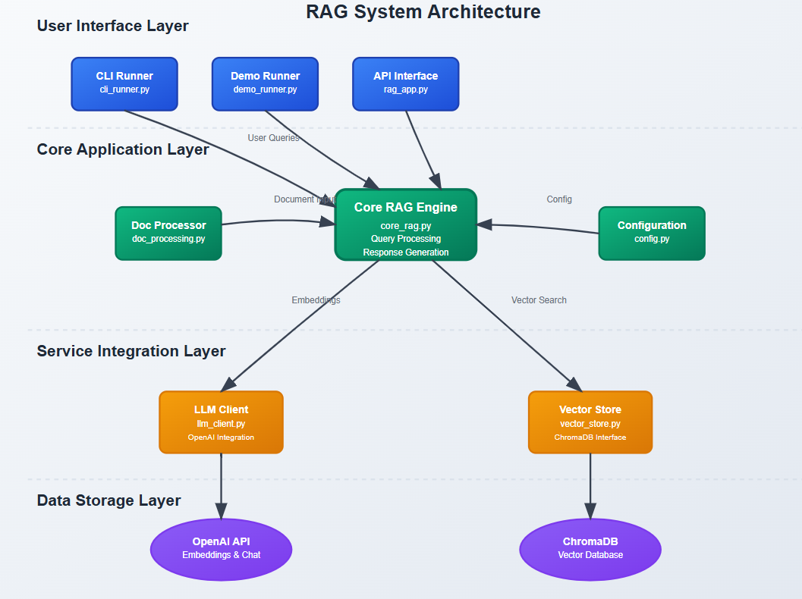

# Professional RAG System with ChromaDB and OpenAI

A robust, modular Retrieval-Augmented Generation (RAG) system leveraging OpenAI's LLMs and ChromaDB for vector storage. This project is designed for extensibility, clarity, and real-world use, with a focus on best practices and professional code organization.

---

## Table of Contents
- [Overview](#overview)
- [Features](#features)
- [Architecture](#architecture)
- [Project Structure](#project-structure)
- [Setup & Installation](#setup--installation)
- [Configuration](#configuration)
- [Usage](#usage)
  - [Quick Start (CLI)](#quick-start-cli)
  - [Python API Usage](#python-api-usage)
  - [Demo Scripts](#demo-scripts)
- [Document Processing](#document-processing)
- [Extending the System](#extending-the-system)
- [Troubleshooting & Tips](#troubleshooting--tips)
- [Dependencies](#dependencies)
- [License](#license)
- [Contributing](#contributing)

---

## Overview
This project implements a professional RAG (Retrieval-Augmented Generation) pipeline:
- **Document Ingestion**: Load, chunk, and embed documents (text, files, web pages).
- **Vector Storage**: Store embeddings in ChromaDB for fast similarity search.
- **Retrieval**: Find relevant documents for a user query.
- **Generation**: Use OpenAI's LLMs to answer questions using retrieved context.

Full Article : [https://medium.com/@learn-simplified/learn-rag-by-doing-it-with-simple-approach-github-repo-ai-agent-2251874048c9




The codebase is modular, with clear separation of concerns for configuration, vector storage, LLM interaction, document processing, and CLI/demo utilities.

---

## Features
- **OpenAI Integration**: Supports latest OpenAI embedding and chat models.
- **ChromaDB Vector Store**: Local, persistent vector database for fast retrieval.
- **Flexible Document Processing**: Chunking, file and web ingestion, metadata support.
- **Interactive CLI**: Colorful, user-friendly command-line interface.
- **Extensible Demos**: Example scripts for basic, advanced, and interactive usage.
- **Environment-based Configuration**: Secure, flexible, and production-ready.
- **Professional Code Structure**: Modular, testable, and easy to extend.

---

| Component | Technology | Purpose |
|-----------|------------|---------|
| Language Model | OpenAI GPT-4o-mini | Response generation and chat completion |
| Embeddings | OpenAI text-embedding-3-small | Document vectorization for semantic search |
| Vector Database | ChromaDB | Persistent storage and similarity search |
| Text Processing | LangChain Text Splitters | Document chunking and preprocessing |
| Web Scraping | BeautifulSoup4 + Requests | Web content extraction and processing |
| Environment Config | python-dotenv | Secure API key and configuration management |
| CLI Interface | Colorama | Enhanced terminal output and user experience |
| HTTP Client | Requests | API communication and web data fetching |
| Math Operations | NumPy | Vector calculations and numerical processing |
| Token Management | Tiktoken | OpenAI token counting and optimization |
| Runtime | Python 3.8+ | Core programming language and ecosystem |


## Architecture
```
[User/CLI/API]
     |
[core_rag.py] <--- [llm_client.py] (OpenAI)
     |           <--- [config.py] (env/config)
     |
[vector_store.py] (ChromaDB)
     |
[doc_processing.py] (chunking, ingestion)
```

---

## Project Structure
```
.
├── cli_runner.py         # Main CLI entry point (colorful, interactive)
├── config.py             # Loads environment/config variables
├── core_rag.py           # Core RAG pipeline logic
├── demo_runner.py        # Demos: basic, document, interactive
├── doc_processing.py     # Document chunking, file/web ingestion
├── document_utils.py     # (Legacy) Document processing utilities
├── example_script.py     # (Legacy) Example usage
├── llm_client.py         # OpenAI API wrapper
├── rag_app.py            # (Legacy) Monolithic RAG app
├── vector_store.py       # ChromaDB vector store logic
├── requirements.txt      # Python dependencies
├── .env                  # Environment variables (see below)
├── README.md             # This file
└── chroma_db/            # ChromaDB persistent storage
```

---

## Setup & Installation

### 1. Clone the Repository
```bash
git clone <repository-url>
cd <project-folder>
```

### 2. Install Dependencies
```bash
pip install -r requirements.txt
```

### 3. Configure Environment Variables
Create a `.env` file in the project root (see `.env.template` if available):
```env
OPENAI_API_KEY=sk-...your_openai_key...
CHROMA_DB_PATH=./chroma_db
EMBEDDING_MODEL=text-embedding-3-small
CHAT_MODEL=gpt-4o-mini
```

---

## Configuration
- **OPENAI_API_KEY**: Your OpenAI API key (required)
- **CHROMA_DB_PATH**: Path for ChromaDB storage (default: `./chroma_db`)
- **EMBEDDING_MODEL**: OpenAI embedding model (default: `text-embedding-3-small`)
- **CHAT_MODEL**: OpenAI chat model (default: `gpt-4o-mini`)

---

## Usage

### Quick Start (CLI)
Run the interactive CLI:
```bash
python cli_runner.py
```
- Loads sample documents
- Lets you ask questions interactively
- Colorful output for answers and sources

### Python API Usage
```python
from core_rag import CoreRAG
from config import load_config

rag = CoreRAG(load_config())
documents = [
    {'text': 'Your content...', 'metadata': {'source': 'example'}, 'id': 'doc_1'}
]
rag.add_documents(documents)
result = rag.query("Your question here")
print(result['answer'])
```

### Demo Scripts
Run all demos:
```bash
python demo_runner.py
```
- **Basic Usage**: Loads sample docs, runs example queries
- **Document Processing**: Shows file/web chunking
- **Interactive Session**: Query loaded docs in a loop

---

## Document Processing
- **Chunking**: Documents are split into overlapping chunks for better retrieval.
- **File Ingestion**: Use `process_file()` to chunk and ingest text files.
- **Web Ingestion**: Use `process_url()` to fetch, clean, and chunk web pages.
- **Raw Text**: Use `process_text()` for manual input.

Example:
```python
from doc_processing import DocProcessor
processor = DocProcessor(chunk_size=1000, chunk_overlap=200)
docs = processor.process_file('path/to/file.txt')
rag.add_documents(docs)
```

---

## Extending the System
- **Add new document types**: Extend `DocProcessor` for PDFs, etc.
- **Swap vector DB**: Replace `vector_store.py` for other vector DBs.
- **Change LLM provider**: Update `llm_client.py` for Anthropic, Azure, etc.
- **Add metadata filtering**: Enhance retrieval logic in `vector_store.py`.
- **Integrate with web apps**: Use `core_rag.py` as a backend module.

---

## Troubleshooting & Tips
- **API Key Errors**: Ensure your `.env` is correct and the key is valid.
- **ChromaDB Issues**: Delete `chroma_db/` if you want a fresh start.
- **Import Errors**: Run `pip install -r requirements.txt` again.
- **Performance**: Tune chunk size/overlap and `n_results` for your use case.
- **Color Output**: If colors don't show, ensure your terminal supports ANSI colors.

---

## Dependencies
- `openai` - OpenAI API client
- `chromadb` - Vector database
- `python-dotenv` - Environment variable management
- `requests` - HTTP requests for web scraping
- `beautifulsoup4` - HTML parsing
- `langchain-text-splitters` - Text chunking utilities
- `colorama` - Colorful CLI output
- `numpy` - Math backend for embeddings

---

## License
MIT License - use, modify, and contribute freely.

---

## Contributing
1. Fork the repository
2. Create a feature branch
3. Make your changes (with tests if possible)
4. Submit a pull request

---

## Advanced Topics & Ideas
- Add PDF/document ingestion (see `PyPDF2` or `pdfplumber`)
- Implement hybrid search (dense + keyword)
- Add conversation memory/history
- Use advanced OpenAI models (e.g., `gpt-4-turbo`)
- Deploy as a web API (FastAPI, Flask)
- Integrate with front-end apps (Streamlit, React)

---

For questions, issues, or suggestions, please open an issue or pull request on GitHub.

